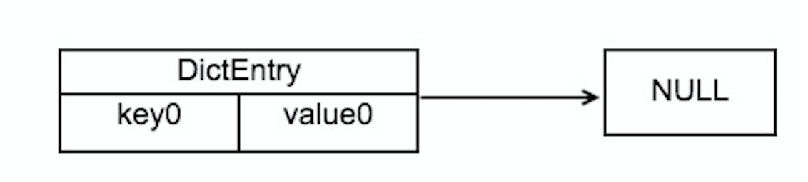
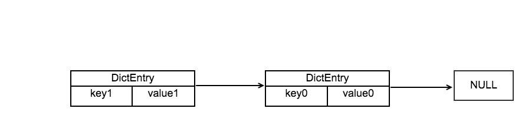
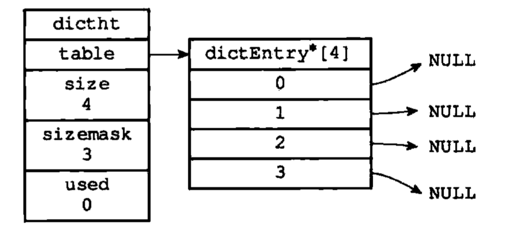
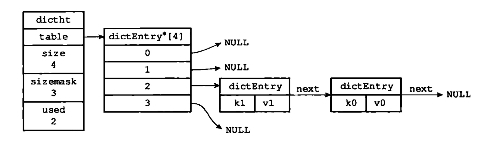
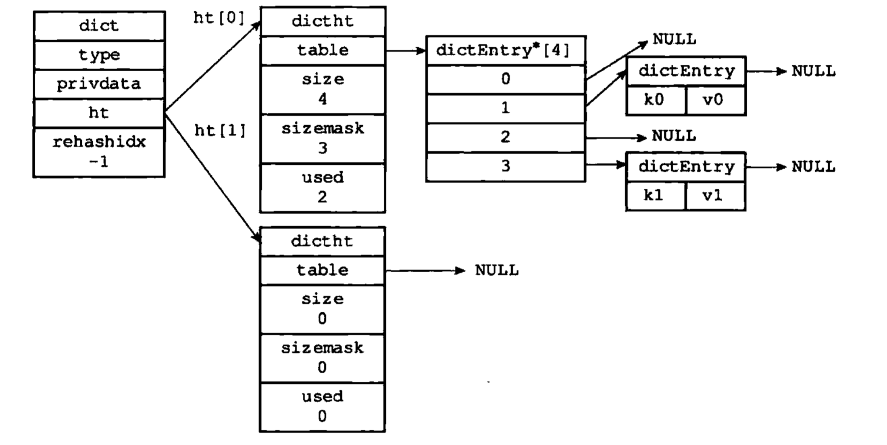

> 本篇将介绍 Redis 中 字典 的实现原理

# redis 字典

字典是一种高效的数据结构，它内嵌在很多高级编程语言上，例如：java 的 HashMap、Python 的 字典。并且被广泛引用于 key-value 存储中，字典可以又可以称为符号表、映射表或者关联数组。字典中的键值对是独一无二的，每个键对应一个值(每个key对应一个value)，不会出现重复的现象。

字典在 redis 的使用十分广泛，redis 的数据库底层就是由字典是实现，redis 数据库的增、删、改、查都是建立在对字典的操作之上。字典还是哈希键的实现方式之一，当哈希键的键值对数目太多或者key对应的元素是比较长的字符串时，redis 就会选用字典作为哈希键的底层实现。

# redis 字典的实现

我们由里向外探寻 redis 字典的实现。

### 哈希节点

在 redis 源文件 dict.h 中我们可以看到哈希节点的具体实现：

	typedef struct dictEntry {
		//key是哈希表的键，
	    void *key;
	    //可存储类型
	    union {
	        void *val;
	        uint64_t u64;
	        int64_t s64;
	        double d;
	    } v;
	    //记录下一个哈希节点的地址
	    struct dictEntry *next;
	} dictEntry;
	

dictEntry 中，key 是哈希节点的键，v 是哈希节点的值，v 的取值可以是一个指针、一个 uint64_t u64 整数、一个 int64_t s64 整数或者是一个double类型的浮点数。

*next 记录的是下一个哈希节点的地址，我们要将键相同的哈希节点以单链表的形式存放，以解决哈希键冲突的问题。

看看下面的图示：

这是一个哈希节点 key0 -> value0

当我们添加一个新的哈希节点时，会如下图所示：

添加一个 key1 -> value1 节点

可以看到新加入的节点 key1 -> value1 插在了 key0 -> value0 之前，为什么要这样呢？因为当哈希键重复较多，也就是这个链表的哈希节点太多时，我们要插入一个新的哈希节点，那么我们就必须遍历这个链表，从而找到尾节点将其插入。而 redis 采用了头插法的策略，将原先插入时间复杂度为 O(n) 降到了 时间复杂度为 O(1)，大大提高了效率。

### 哈希表

在 redis 源文件 dict.h 中我们可以看到哈希表的具体实现：

	typedef struct dictht {
	    //定义哈希表数组
	    dictEntry **table;
	    //哈希表数组的长度
	    unsigned long size;
	    //哈希表大小的掩码，该值通常为size-1，用于进行哈希计算
	    unsigned long sizemask;
	    //用于记录哈希表已经使用的空间
	    unsigned long used;
	} dictht;
	

table 是一个数组，每个数组都是一个指向 dictEntry 类型的指针，size 记录了数组的长度，used 记录数组使用的情况。sizemask 总为 size ，用于和哈希值进行运算，确定这个键该放在 table 哪个索引上。

下图是一个空的哈希表：

下图是一个插入了两个节点的哈希表：

	

### 字典

在 redis 源文件 dict.h 中我们可以看到字典的具体实现：

	typedef struct dict {
	    //类型特定函数
	    dictType *type;
	    //私有数据
	    void *privdata;
	    //哈希表
	    dictht ht[2];
	    //rehash索引，当rehash不进行时，该值为-1
	    long rehashidx; 
	    //迭代器
	    int iterators; 
	} dict;

type 属性和 privdata 属性是针对不同类型的键值对，为创建多态字典而设置。

