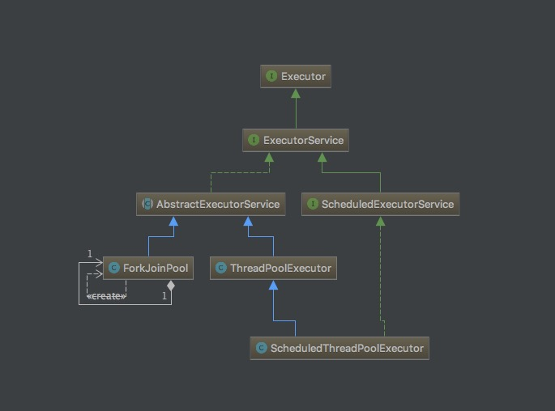

# Java 并发框架的学习(一)
今天学习了 Java 的并发框架，先来说说并发中最常用的东西吧----线程池。线程池是什么？我的理解就是将一堆线程放在一个池子了里进行统一的管理，例如创建新的线程、分配任务、销毁线程等等。为什么要用线程池？我来一个 task 就 new Thread 不好么？方便省事。但创建线程和销毁线程是需要消耗系统性能为代价的，可能执行 task 的时间比创建线程、销毁线程的时间要少得多。使用了线程池在并发编程中可以提高我们程序性能。

线程池的优点：

- 提高响应速度

	不需要线程创建和销毁可以提高响应速度。
	
- 降低资源消耗

	不需要频繁的创建和销毁线程，线程使用完可以复用，降低资源消耗。

- 提高可管理性

	可以限制线程数量，获取线程总数、程序结束时对任务的处理策略等等。
	
# Executor 

Executor 执行器为我们提供了管理线程的方法。主要是将任务的提交和任务的执行进行解耦。

Executor 接口中只定义了一个方法：

	public interface Executor {
	
	    void execute(Runnable command);
	
	}
	
参数是一个 Runnable

# Executor 的扩展接口和实现类

Executor 的扩展接口主要是 ExecutorService 和 ScheduleExecutorService ，和三个比较重要的实现类 ThreadpoolExecutor 、 ForkJoinPool 和 ScheduleThreadPoolExecutor。

下面是它们之间的 UML 图：

# ThreadPoolExecute 类

##### 构造方法

看看 ThreadPoolExecute 类的构造方法：

	public ThreadPoolExecutor(int corePoolSize,
	                              int maximumPoolSize,
	                              long keepAliveTime,
	                              TimeUnit unit,
	                              BlockingQueue<Runnable> workQueue,
	                              ThreadFactory threadFactory,
	                              RejectedExecutionHandler handler)

这是 ThreadPoolExecute 类最全的一个构造方法。

- corePoolSize 

	corePoolSize 参数定义了核心线程的数量

- maximumPoolSize 

	maximumPoolSize 参数定义了最大线程的数量，当核心线程、任务队列和非核心线程都已经分配任务，没有空闲的线程时，可能会 reject 新进来的任务，具体要看执行的策略。
	
- keepAliveTime

	keepAliveTime 设置空闲线程的存活周期
	
- TimeUnit

	TimeUnit 设置时间单位
	
- BlockingQueue

	BlockingQueue 这是一个阻塞队列，当核心线程数量满时，新来的任务将进入队列，等待核心线程调取任务。
	
- ThhredFactory 

	ThreadFactory 用来管理线程

# Worker 类

# execute() 方法
execute() 方法可传入的参数为 Runnable，用于执行给定的任务。如果线程为 Null ，将抛出空指针异常。ThreadPoolExecutor 通过 AtomicInteger 进行计数，当

    public void execute(Runnable command) {
        if (command == null)
        	//如果线程为Null，那么抛出NullPointerException()异常
            throw new NullPointerException();
        int c = ctl.get();
        //如果当前工作线程数小于核心线程数那么，将添加一个 worker
        if (workerCountOf(c) < corePoolSize) {
            if (addWorker(command, true))
                return;
            c = ctl.get();
        }
        //如果核心线程满了，判断队列是否满了
        if (isRunning(c) && workQueue.offer(command)) {
        	//如果没有满那么将任务加入队列，等待核心线程
            int recheck = ctl.get();
            if (! isRunning(recheck) && remove(command))
                reject(command);
            else if (workerCountOf(recheck) == 0)
                addWorker(null, false);
        }
        else if (!addWorker(command, false))
            reject(command);
    }

# addWorker() 方法
addWorker 方法

    private boolean addWorker(Runnable firstTask, boolean core) {
        retry:
        for (;;) {
        	//ctl 是
            int c = ctl.get();
            int rs = runStateOf(c);

            // Check if queue empty only if necessary.
            if (rs >= SHUTDOWN &&
                ! (rs == SHUTDOWN &&
                   firstTask == null &&
                   ! workQueue.isEmpty()))
                return false;

            for (;;) {
                int wc = workerCountOf(c);
                if (wc >= CAPACITY ||
                    wc >= (core ? corePoolSize : maximumPoolSize))
                    return false;
                if (compareAndIncrementWorkerCount(c))
                    break retry;
                c = ctl.get();  // Re-read ctl
                if (runStateOf(c) != rs)
                    continue retry;
                // else CAS failed due to workerCount change; retry inner loop
            }
        }

        boolean workerStarted = false;
        boolean workerAdded = false;
        Worker w = null;
        try {
            w = new Worker(firstTask);
            final Thread t = w.thread;
            if (t != null) {
                final ReentrantLock mainLock = this.mainLock;
                mainLock.lock();
                try {
                    // Recheck while holding lock.
                    // Back out on ThreadFactory failure or if
                    // shut down before lock acquired.
                    int rs = runStateOf(ctl.get());

                    if (rs < SHUTDOWN ||
                        (rs == SHUTDOWN && firstTask == null)) {
                        if (t.isAlive()) // precheck that t is startable
                            throw new IllegalThreadStateException();
                        workers.add(w);
                        int s = workers.size();
                        if (s > largestPoolSize)
                            largestPoolSize = s;
                        workerAdded = true;
                    }
                } finally {
                    mainLock.unlock();
                }
                if (workerAdded) {
                    t.start();
                    workerStarted = true;
                }
            }
        } finally {
            if (! workerStarted)
                addWorkerFailed(w);
        }
        return workerStarted;
    }
    
    
    
    
    
# 程序终止时执行策略
当程序终止时，会调用两个方法：

- shutdown()
- shutdownNow()

从这两个方法可以看出，一个是温柔的关闭所有线程和任务，一个是立即中断所有线程和任务。

##### shutdown() 方法
shutdown() 方法中断线程比较平滑，不会立即中断线程和结束任务。

    public void shutdown() {
        final ReentrantLock mainLock = this.mainLock;
        mainLock.lock();
        try {
            checkShutdownAccess();
            advanceRunState(SHUTDOWN);
            interruptIdleWorkers();
            onShutdown(); 
        } finally {
            mainLock.unlock();
        }
        tryTerminate();
    }

##### shutdownNow() 方法
执行这个方法就比较暴力，直接 stop 。

    public List<Runnable> shutdownNow() {
        List<Runnable> tasks;
        final ReentrantLock mainLock = this.mainLock;
        mainLock.lock();
        try {
            checkShutdownAccess();
            advanceRunState(STOP);
            interruptWorkers();
            tasks = drainQueue();
        } finally {
            mainLock.unlock();
        }
        tryTerminate();
        return tasks;
    }

